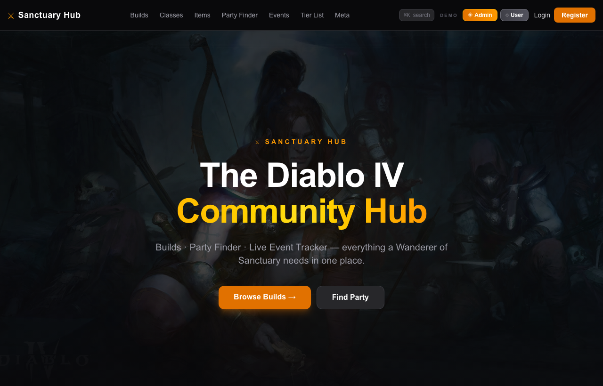
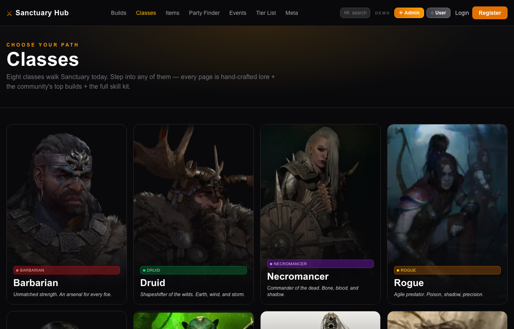
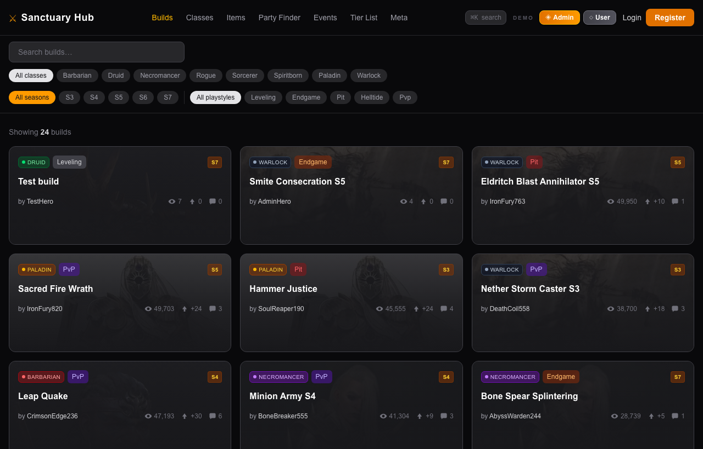
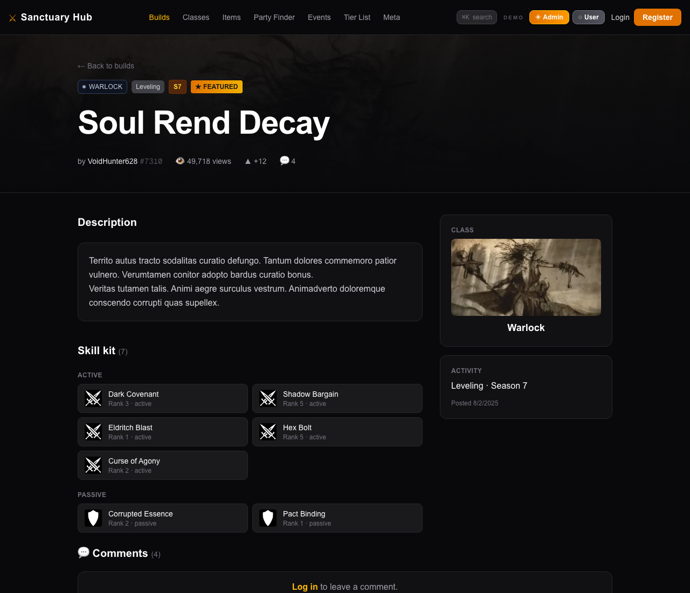
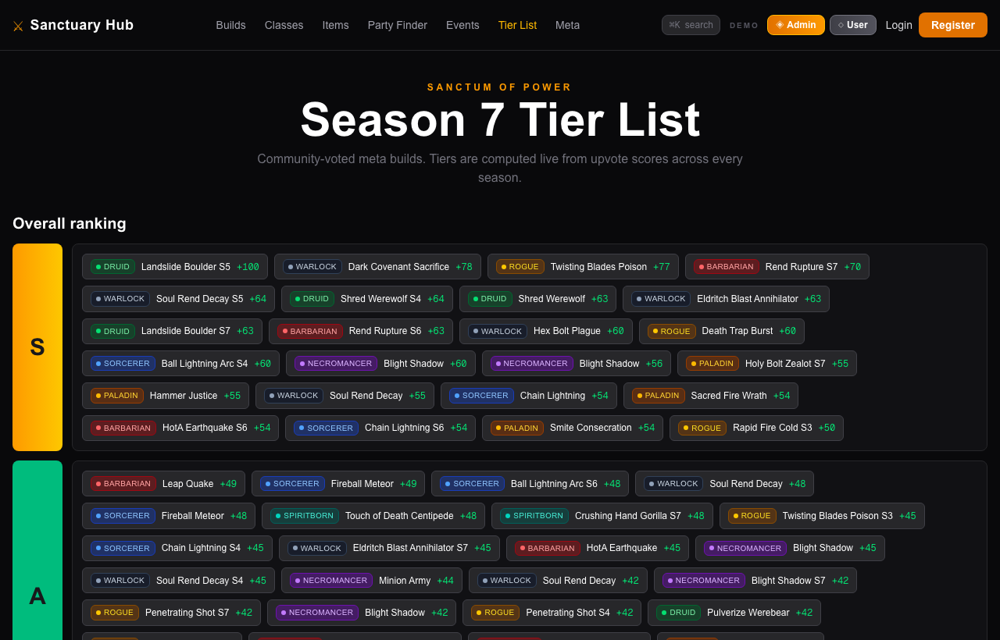
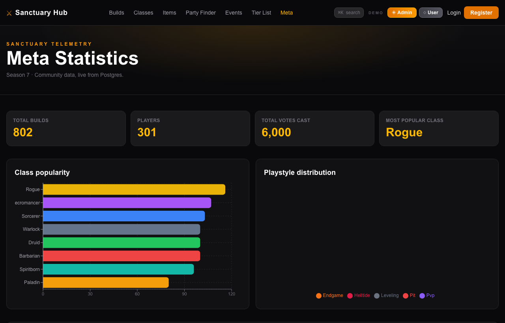
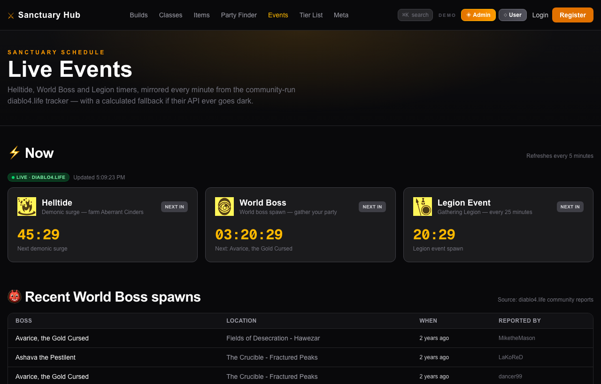
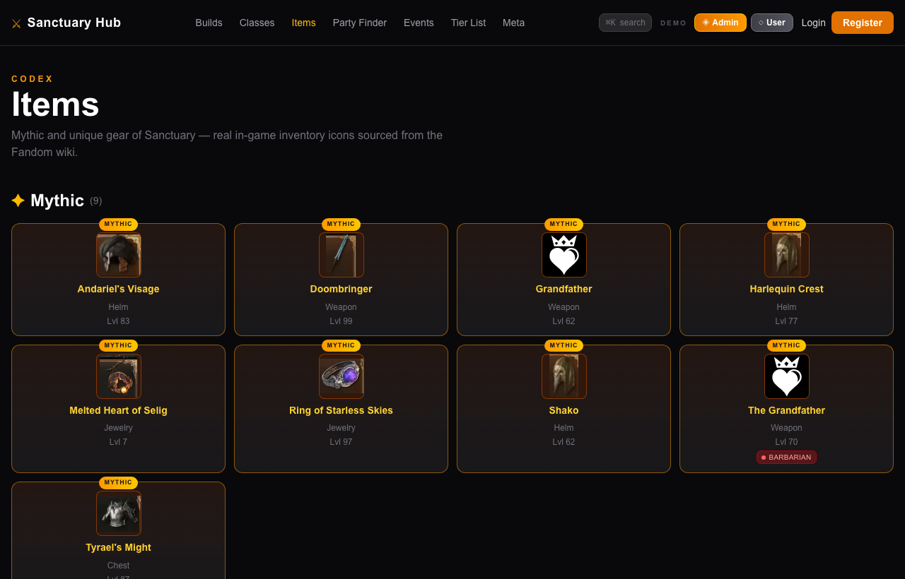
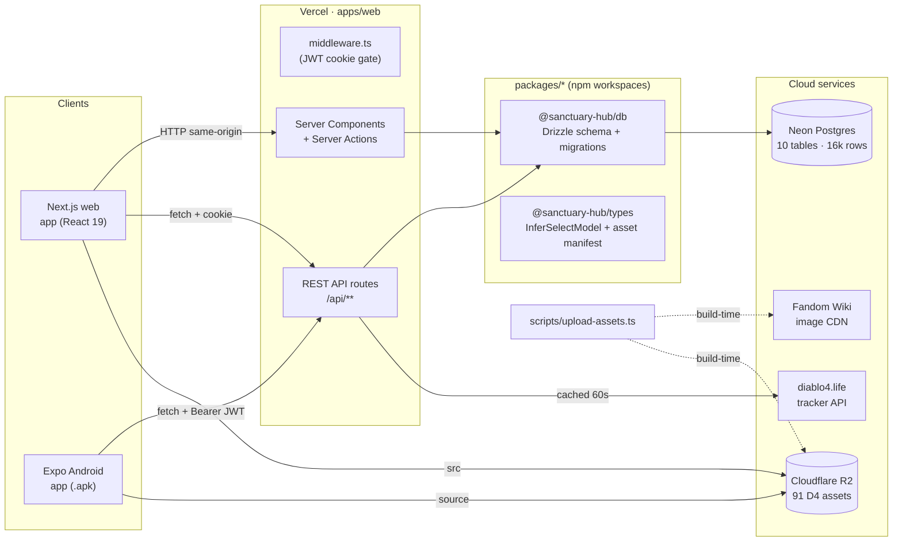
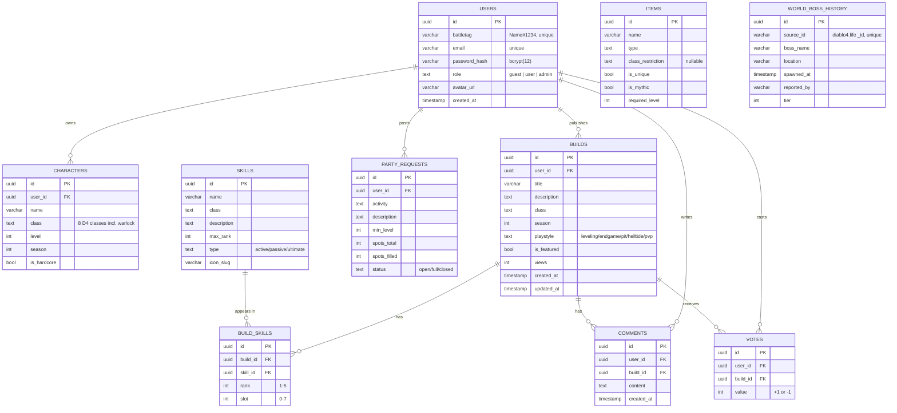

<div align="center">

<!-- HERO -->


# ⚔ Sanctuary Hub

**The Diablo IV Community Hub — Builds · Party Finder · Live Event Tracker**

[](https://nextjs.org)
[](https://react.dev)
[](https://www.typescriptlang.org)
[](https://tailwindcss.com)
[](https://orm.drizzle.team)
[](https://neon.tech)
[](https://developers.cloudflare.com/r2/)
[](https://expo.dev)
[](https://diablo-4-sanctuary-hub-web.vercel.app)

[🌐 Live demo](https://diablo-4-sanctuary-hub-web.vercel.app) ·
[📱 Android APK](https://expo.dev/accounts/bat-gogo/projects/sanctuary-hub/builds/4abd4731-051e-4626-978b-783e03ee02d2) ·
[🗄 GitHub](https://github.com/bat-gogo/diablo-4-sanctuary-hub) ·
[🚀 Deploy guide](./DEPLOY.md)

</div>

---

## What is it?

**Sanctuary Hub** is a community platform for *Diablo IV* players: publish your
character builds, discover what the meta is running this season, find a party
for endgame activities, and track in-game events without leaving the tab.

It's a full-stack capstone project for the **SoftUni AI — Full-Stack Apps with
AI** course, built end-to-end with AI-assisted development. Single codebase
ships **both** a Next.js web client and an Expo Android app, backed by a
serverless Postgres + Cloudflare R2 + Vercel deployment.

### Who does what

| Role     | Can do                                                                                                                                                |
| -------- | ----------------------------------------------------------------------------------------------------------------------------------------------------- |
| Guest    | Read public pages — builds, items, tier list, events, classes, meta dashboard                                                                          |
| User     | Everything above + register/login, create & edit characters, publish & edit builds, vote & comment on builds, post & join party requests, edit their profile |
| Admin    | Everything above + Control Room — manage all users (role changes), feature/unfeature builds, delete any build/party, view aggregate stats             |

---

## ⚡ Try it now

| Live web app           | <https://diablo-4-sanctuary-hub-web.vercel.app>                                                                  |
| ---------------------- | ---------------------------------------------------------------------------------------------------------------- |
| Android APK            | Android .apk  [release]([https://expo.dev/accounts/bat-gogo/projects/sanctuary-hub/builds/4abd4731-051e-4626-978b-783e03ee02d2](https://github.com/bat-gogo/diablo-4-sanctuary-hub/releases/tag/diablo-4-sanctuary-hub-for-adnroid) |

### Demo credentials (one-tap on the login screen)

| Email                       | Password         | Role  |
| --------------------------- | ---------------- | ----- |
| `admin@sanctuaryhub.gg`     | `AdminPass123!`  | admin |
| `user@test.com`             | `Password123!`   | user  |

Both the web `/login` page and the mobile login screen ship with **◈ Admin
demo** and **◇ User demo** buttons that sign in automatically — no typing.

---

## ✨ Features

**Community**
- 🏛 19+ web screens, fully responsive (desktop + tablet + mobile)
- ⚔ Build creator with a 3-step form — class portrait picker, skill kit
  with rank sliders, live preview before publish
- 💬 Real comments system on each build with optimistic UI
- ▲ Up/downvote on builds
- 👥 Party finder with activity filters, atomic Join (race-safe), edit/delete

**Live**
- ⚡ Event tracker — Helltide / World Boss / Legion countdowns at 1Hz,
  sourced from [diablo4.life](https://diablo4.life) with a calculated
  fallback if their tracker goes dark
- 👹 Recent world-boss spawns mirrored from the diablo4.life report API
  into our own table (idempotent re-imports)

**Meta**
- 📊 Recharts-powered dashboard — class popularity, season distribution,
  playstyle split, vote sentiment, top builds leaderboard
- 🏆 Real tier list — builds bucketed S/A/B/C/D by community vote score,
  plus per-class top-6 sections

**Power-user**
- ⌘K command palette — fuzzy search across all builds, skills, items
  (fuse.js)
- 🎭 8 D4 classes incl. **Warlock** (Lord of Hatred expansion)
- ✦ Rank system — Nephalem → Explorer → Hero → Champion → Legend computed
  from each user's activity score
- 🛡 Admin Control Room with stat cards, user role editor, feature curator

**Mobile (Expo Android)**
- 📱 6 screens — Login / Register / Home / Builds / Party / Profile / Build detail
- 🔐 SecureStore-persisted JWT, Bearer-token API client
- 🎨 Shares the R2 asset bucket with web — real D4 portraits + skill icons

---

## 📸 Screenshots

<table>
  <tr>
    <td width="50%"></td>
    <td width="50%"></td>
  </tr>
  <tr>
    <td align="center"><sub><b>Home</b> · hero + live events + featured</sub></td>
    <td align="center"><sub><b>Classes</b> · 8 portrait cards</sub></td>
  </tr>
  <tr>
    <td></td>
    <td></td>
  </tr>
  <tr>
    <td align="center"><sub><b>Build Browser</b> · filter pills + grid</sub></td>
    <td align="center"><sub><b>Build Detail</b> · Warlock kit + skills</sub></td>
  </tr>
  <tr>
    <td></td>
    <td></td>
  </tr>
  <tr>
    <td align="center"><sub><b>Tier list</b> · live vote-derived ranking</sub></td>
    <td align="center"><sub><b>Meta dashboard</b> · recharts</sub></td>
  </tr>
  <tr>
    <td></td>
    <td></td>
  </tr>
  <tr>
    <td align="center"><sub><b>Events</b> · diablo4.life timers + history</sub></td>
    <td align="center"><sub><b>Items</b> · mythic + unique codex</sub></td>
  </tr>
</table>

---

## 🧱 Tech stack

| Layer              | Tools                                                                                                  |
| ------------------ | ------------------------------------------------------------------------------------------------------ |
| Web app            | **Next.js 16** (App Router + Turbopack) · React 19 · TypeScript 5 · Tailwind CSS v4                    |
| Mobile app         | **Expo SDK 54** · Expo Router 6 · React Native 0.81 · expo-secure-store                                |
| Database           | **Neon serverless Postgres 17** (eu-central-1) · Drizzle ORM 0.36 · drizzle-kit migrations             |
| Auth               | **JWT** via `jose` (Edge + Node compatible) · bcryptjs (rounds=12) · httpOnly cookie + Bearer header   |
| Object storage     | **Cloudflare R2** (`sanctuary-hub-assets` bucket, public r2.dev domain, 91 files)                      |
| Live data          | [diablo4.life](https://diablo4.life) public tracker API · Fandom MediaWiki API (assets)                |
| UI extras          | Framer Motion · Recharts · cmdk · fuse.js · @tailwindcss/typography                                    |
| Validation         | Zod 4                                                                                                  |
| Web hosting        | Vercel (Edge middleware + Node runtime)                                                                |
| Mobile build       | **EAS Build** (Expo cloud) → `.apk`                                                                    |
| Tooling            | npm workspaces · tsx · ESLint                                                                          |

---

## 🏗 Architecture



- **Web ↔ backend** runs in the same Vercel deployment. Server Components hit
  Drizzle directly, Server Actions / mutations use the same REST endpoints
  that the mobile app talks to.
- **Mobile ↔ backend** uses pure REST over HTTPS with the JWT in an
  `Authorization: Bearer …` header (token persisted in SecureStore).
- **Middleware** gates `/admin`, `/dashboard`, `/builds/create` by reading the
  JWT cookie before the page renders.
- **R2** is the only place we keep binary assets (class portraits, skill
  icons, item icons) — public CDN URLs are baked into the asset manifest in
  `packages/types/src/assets.ts`.
- The **event tracker** is a thin server-side proxy of diablo4.life with a
  cyclic-fallback so the UI never breaks.

---

## 🗄 Database schema

10 Postgres tables, 12 indexes, 8 foreign keys, full Drizzle migrations under
[`packages/db/migrations/`](./packages/db/migrations) (committed SQL).
Population: 301 users · 800 builds · 5,180 build_skills · 6,000 votes ·
3,000 comments · 400 party requests · 189 skills · 109 items · 5 world boss
history reports = **16,042 rows**.



> Cursor-based pagination is used everywhere (`(createdAt DESC, id DESC)`
> stable tuple) — no offset pagination. Drizzle relations are wired so
> `getBuildById` returns the full skill kit + author in a single round trip.

---

## 📁 Repo structure

```
diablo-4-sanctuary-hub/
├── AGENTS.md                ← project-wide instructions for AI dev agents
├── DEPLOY.md                ← Vercel + EAS Build walkthrough
├── README.md                ← this file
├── package.json             ← npm workspaces root (apps/* + packages/*)
├── apps/
│   ├── web/                 ← Next.js 16 web client + backend
│   │   ├── app/
│   │   │   ├── (auth)/      ← login, register pages
│   │   │   ├── (main)/      ← public + gated screens
│   │   │   │   ├── admin/   ← admin panel (overview, users, builds, featured)
│   │   │   │   ├── builds/  ← list, create, [id], [id]/edit
│   │   │   │   ├── classes/ ← class showcase
│   │   │   │   ├── events/  ← live timers + boss history
│   │   │   │   ├── meta/    ← recharts dashboard
│   │   │   │   ├── party/   ← party finder
│   │   │   │   ├── players/ ← player profile
│   │   │   │   ├── tier-list/
│   │   │   │   └── dashboard/
│   │   │   └── api/         ← REST routes consumed by mobile + web
│   │   ├── components/      ← UI (BuildCard, EventTracker, CommandPalette…)
│   │   ├── lib/
│   │   │   ├── services/    ← Drizzle-backed business logic
│   │   │   ├── validations/ ← Zod schemas
│   │   │   ├── auth.ts      ← jose-based JWT helpers
│   │   │   ├── db.ts        ← Drizzle + neon-http singleton
│   │   │   └── ranks.ts     ← rank tier calculations
│   │   ├── middleware.ts    ← JWT gate for /admin /dashboard /builds/create
│   │   ├── next.config.ts
│   │   └── vercel.json      ← monorepo install override
│   │
│   └── mobile/              ← Expo SDK 54 Android app
│       ├── app/
│       │   ├── _layout.tsx  ← AuthProvider + route gate
│       │   ├── (auth)/      ← login, register
│       │   ├── (tabs)/      ← home, builds, party, profile
│       │   └── builds/[id].tsx
│       ├── components/      ← ClassBadge…
│       ├── lib/             ← api, auth, theme, assets
│       ├── app.json
│       ├── eas.json         ← preview / production-apk / production
│       └── BUILD.md         ← APK build instructions
│
├── packages/
│   ├── db/                  ← @sanctuary-hub/db
│   │   ├── src/
│   │   │   ├── schema.ts    ← 10 pgTable() definitions + relations
│   │   │   ├── index.ts     ← neon-http drizzle client + re-exports
│   │   │   ├── migrate.ts   ← migration runner
│   │   │   └── seed.ts      ← 16k row seed (real D4 names + faker)
│   │   ├── migrations/      ← committed SQL ⇡ exam requirement
│   │   │   ├── 0000_cool_vivisector.sql
│   │   │   └── 0001_cuddly_bloodaxe.sql
│   │   └── drizzle.config.ts
│   │
│   └── types/               ← @sanctuary-hub/types
│       └── src/
│           ├── index.ts     ← InferSelectModel types
│           └── assets.ts    ← R2 asset manifest (ASSETS map + helpers)
│
├── scripts/
│   ├── upload-assets.ts     ← Fandom + game-icons → R2 pipeline
│   ├── seed-boss-history.ts ← diablo4.life → world_boss_history sync
│   └── data-explore/
│       ├── SOURCES.md       ← public D4 API audit
│       └── responses/       ← raw probe JSON
│
└── docs/
    └── screenshots/         ← README assets
```

---

## 🛠 Local development

### Prerequisites

| Tool       | Version       |
| ---------- | ------------- |
| Node.js    | ≥ 20 (tested on 24.14) |
| npm        | ≥ 10          |
| A Neon account | for `DATABASE_URL` (or any Postgres 15+) |
| A Cloudflare R2 bucket | optional — assets work read-only without one |

### Setup

```bash
# 1. Clone
git clone https://github.com/bat-gogo/diablo-4-sanctuary-hub.git
cd diablo-4-sanctuary-hub

# 2. Install everything (workspaces pull all three packages)
npm install

# 3. Configure the web env
cp apps/web/.env.local.example apps/web/.env.local
# then edit apps/web/.env.local and set at minimum:
#   DATABASE_URL=postgresql://…/neondb?sslmode=require
#   JWT_SECRET=<random 64-char hex — `openssl rand -hex 32`>
#   NEXT_PUBLIC_R2_PUBLIC_URL=https://pub-…r2.dev   (or skip if no R2)

# 4. Configure the db env (used by drizzle-kit)
cp /dev/null packages/db/.env  # creates empty file
echo "DATABASE_URL=$(grep ^DATABASE_URL apps/web/.env.local | cut -d= -f2-)" >> packages/db/.env

# 5. Run the migrations against your DB
npm run db:migrate

# 6. Seed (~16k rows; takes ~11s on Neon eu-central-1)
npm run db:seed

# 7. Start the dev server
npm run dev:web
#    → http://localhost:3000
```

### Mobile dev

```bash
cd apps/mobile
npx expo start
# scan the QR with Expo Go (iOS/Android) — the API URL is auto-detected
# from your dev machine's LAN IP via Constants.expoConfig.hostUri
```

### Common scripts

| Command                                          | What it does                                   |
| ------------------------------------------------ | ---------------------------------------------- |
| `npm run dev:web`                                | Start Next.js dev (Turbopack) on `:3000`       |
| `npm run dev:mobile`                             | Start Expo dev server                          |
| `npm run db:generate -w packages/db`             | Generate a Drizzle migration from schema diff  |
| `npm run db:migrate -w packages/db`              | Apply pending migrations                       |
| `npm run db:seed -w packages/db`                 | Wipe + reseed (idempotent)                     |
| `npx tsc --noEmit -w apps/web`                   | Web typecheck (or `-w packages/db` / `-w packages/types`) |

---

## 🚀 Deployment

See **[DEPLOY.md](./DEPLOY.md)** for the full Vercel + EAS Build walkthrough.

Short version:

1. Vercel → import this repo → set Root Directory = `apps/web` → add
   `DATABASE_URL`, `JWT_SECRET`, `NEXT_PUBLIC_R2_PUBLIC_URL` to env.
2. EAS → `eas login` + `eas init` in `apps/mobile` → set the Vercel URL
   in `eas.json` → `eas build --platform android --profile preview`.

---

## 📜 Acknowledgments

- Class portraits + unique item icons — [Fandom Wiki](https://diablo.fandom.com)
  community contributors (used here under fair use for a non-commercial fan
  educational project; all rights remain with Blizzard Entertainment).
- Skill icons — d4builds.gg's public asset CDN (`sunderarmor.com/DIABLO4/`).
- Generic icons / fallbacks — [game-icons.net](https://game-icons.net) MIT.
- Live event data — [diablo4.life](https://diablo4.life) community tracker.

> *Sanctuary Hub is a fan-made educational project and is not affiliated with,
> endorsed, sponsored, or specifically approved by Blizzard Entertainment.
> "Diablo IV" and all related assets are trademarks of Blizzard Entertainment.*
